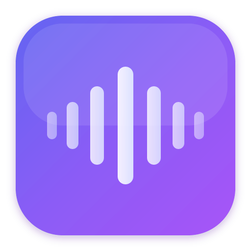

<p align="center">
  
</p>

<h1 align="center">Aria</h1>

<p align="center">
  <strong>A modern, cross-platform SIP softphone.</strong><br/>
  <em>by <a href="https://5060solutions.com">5060 Solutions</a></em>
</p>

<p align="center">
  <a href="https://github.com/5060-Solutions/aria/releases"></a>
  <a href="LICENSE"></a>
  
</p>

---

## Why "Aria"?

In music, an **aria** is a self-contained piece for a single voice -- a melody that carries emotion across space. That's exactly what a softphone does: it carries a single human voice across networks, making distance disappear. The name also nods to "air" (Italian), the invisible medium through which all sound travels.

## Why "5060"?

Port **5060** is the default port for SIP (Session Initiation Protocol) -- the standard that powers VoIP worldwide. 5060 Solutions builds tools for modern voice infrastructure, and Aria is our flagship softphone.

## What is Aria?

Aria is a native SIP softphone built for people who care about call quality and beautiful software. It runs natively on:

- **macOS** (Apple Silicon + Intel, universal binary)
- **Windows** (x64)
- **Linux**

No Electron bloat. No WebRTC dependency. Pure Rust SIP stack with native audio.

## Architecture

```
+----------------------------------+
|   React + MUI (Material You)     |  UI layer
+----------------------------------+
|        Tauri v2 IPC              |  Bridge
+----------------------------------+
|   Rust Backend                   |  App logic & state
+----------------------------------+
|   Pure Rust SIP + Media Stack    |  Signaling & media
+----------------------------------+
```

**Frontend:** React with Material You theming via MUI. Framer Motion animations. Dark and light modes. Zustand for state management with localStorage persistence.

**Backend:** Rust via Tauri v2. The `SipManager` orchestrates registration, call control, presence, and media. Events flow to the frontend via Tauri's emit/listen system.

**SIP Stack:** Pure Rust implementation using `rsip` for SIP message parsing with custom message construction. Supports UDP, TCP, and TLS transports via `tokio` async I/O. Digest authentication (MD5) for registration and call setup.

**Media Stack:** Powered by `rtp-engine`, a high-performance Rust media engine providing native audio via `cpal`, RTP/RTCP handling, SRTP encryption (AES-128-CM + HMAC-SHA1-80), G.711 (μ-law/A-law) and Opus codecs with sample rate conversion, and call recording to WAV. ICE-lite for NAT traversal.

## Features

### Core Calling
- [x] SIP registration with digest authentication (UDP/TCP/TLS)
- [x] Outbound calls with full call setup (INVITE, 200 OK, ACK)
- [x] Inbound calls with 180 Ringing and answer
- [x] Call control: mute, hold, hangup
- [x] DTMF via RTP events (RFC 2833)
- [x] Call transfer: blind (REFER) and attended (REFER with Replaces)
- [x] Presence/BLF via SUBSCRIBE/NOTIFY
- [x] Keepalive via OPTIONS (connection loss detection)
- [x] DNS SRV + A-record resolution

### Media
- [x] G.711 μ-law and A-law codecs
- [x] Opus codec with 8↔48 kHz resampling
- [x] RTP media handling with RTCP sender reports
- [x] SRTP encryption (AES-128-CM + HMAC-SHA1-80)
- [x] Native audio I/O via platform APIs
- [x] ICE-lite (host + server reflexive candidates)

### User Interface
- [x] Material You theming (dark/light modes)
- [x] Dial pad with animated keypress feedback
- [x] Call screen with timer and state display
- [x] Contact list with favorites, search, and alphabetical sections
- [x] Call history with direction, duration, and callback
- [x] Setup wizard with account configuration and advanced options
- [x] Developer diagnostics panel (SIP message log, RTP stats, PCAP export)
- [x] macOS window vibrancy
- [x] Keyboard shortcuts (⌘D dialer, ⌘K hangup, ⌘M mute, ⌘H hold, ⌘R record)
- [x] Multi-language support (English, Spanish, German, French)

### Recording
- [x] Call recording to WAV files
- [x] Per-account auto-record setting (opt-in, off by default)
- [x] Recording indicator during active calls
- [x] Recording path shown in call history

### Planned
- [ ] Video calling
- [ ] Audio device selection UI
- [ ] Conference bridging
- [ ] Google Contacts sync
- [ ] macOS system contacts integration

## Technical Details

### SIP Implementation

Aria uses a **pure Rust SIP stack** -- no PJSIP or other C library dependencies. This provides memory safety throughout, simpler cross-compilation, and smaller binaries.

| Component | Implementation |
|-----------|----------------|
| SIP parsing | `rsip` crate with custom message builder |
| Transport | Async UDP/TCP/TLS via `tokio` and `tokio-rustls` |
| Authentication | Digest (MD5) for REGISTER, INVITE, SUBSCRIBE |
| Media | `rtp-engine` crate for RTP/RTCP, SRTP, audio I/O, codecs |
| Codecs | Opus and G.711 (μ-law/A-law) via `rtp-engine` |
| Recording | WAV file recording via `rtp-engine` |
| NAT traversal | ICE-lite with host and server reflexive candidates |
| Credentials | OS keychain via `keyring` (macOS Keychain, Windows Credential Manager, Linux Secret Service) |

### Key Dependencies

| Crate | Purpose |
|-------|---------|
| `tauri` | Native app framework |
| `rsip` | SIP message parsing |
| `tokio` | Async runtime |
| `tokio-rustls` / `rustls` | TLS transport |
| `rtp-engine` | RTP/RTCP, audio I/O, codecs, SRTP, recording |
| `keyring` | Secure credential storage (OS keychain) |
| `tauri-plugin-dialog` | Native file dialogs |

## Project Structure

```
softphone/
+-- src/                          # React frontend
|   +-- components/
|   |   +-- layout/               # AppShell, NavRail, StatusBar
|   |   +-- dialer/               # Dialer, DialerButton
|   |   +-- call/                 # CallScreen, CallControls
|   |   +-- contacts/             # ContactList
|   |   +-- history/              # CallHistory
|   |   +-- settings/             # Settings
|   |   +-- wizard/               # SetupWizard (account config)
|   |   +-- diagnostics/          # DiagnosticPanel (SIP logs, PCAP)
|   +-- hooks/                    # useCallTimer, useRingtone, useSip
|   +-- stores/                   # Zustand state (appStore.ts)
|   +-- theme/                    # Material You theme (dark/light)
|   +-- types/                    # TypeScript type definitions
+-- src-tauri/                    # Rust backend
|   +-- src/
|       +-- commands.rs           # Tauri IPC command handlers
|       +-- sip/
|           +-- mod.rs            # SipManager (core orchestrator)
|           +-- account.rs        # SIP account configuration
|           +-- auth.rs           # Digest authentication
|           +-- builder.rs        # SIP message construction
|           +-- call.rs           # Call state management
|           +-- codec.rs          # G.711, Opus codecs
|           +-- ice.rs            # ICE-lite implementation
|           +-- media.rs          # RTP/RTCP, audio I/O
|           +-- srtp.rs           # SRTP encryption
|           +-- transport.rs      # UDP/TCP/TLS transports
+-- index.html
+-- package.json
+-- vite.config.ts
+-- README.md
```

## Development

### Prerequisites

- [Node.js](https://nodejs.org/) 20+
- [pnpm](https://pnpm.io/) 9+
- [Rust](https://rustup.rs/) (stable)
- Platform build tools:
  - **macOS:** Xcode Command Line Tools
  - **Windows:** Visual Studio Build Tools (C++ workload)
  - **Linux:** `build-essential`, `libwebkit2gtk-4.1-dev`, `libasound2-dev`

### Setup

```bash
pnpm install
pnpm tauri dev
```

### Build

```bash
# macOS universal binary (ARM + Intel)
pnpm tauri build --target universal-apple-darwin

# Windows (installer via WiX)
pnpm tauri build

# Linux
pnpm tauri build
```

## License

**Free for non-commercial use.** Commercial use requires a separate license.

See [LICENSE](LICENSE) for details. Copyright © 2026 5060 Solutions.

---

Built with Tauri, React, MUI, and Rust by **5060 Solutions**.
